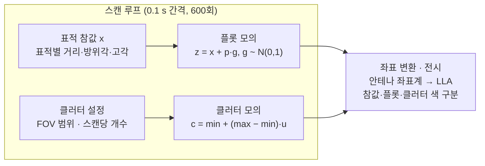

# 플롯·클러터 모의 구현
---

## 1. 문서 읽는 법

모든 요구사항에는 출처 태그가 붙어 있어, 원래 요구사항과 검토 중 추가된 내용을 구분할 수 있다.

- **단위:** 거리 m, 각도 deg, 시간 s, 주파수 Hz. 삼각함수 계산 직전에만 deg → rad로 바꾼다.
- **기호:** x = 참값(True Target), v = 잡음, z = 플롯(측정값), c = 클러터, p = 표준편차.
- **첨자:** rng = 거리, azi = 방위각, ele = 고각.

---

## 2. 용어 [보완]

원문에서 정의가 비어 있던 용어(플롯, 클러터)를 포함해, 이 문서에 나오는 용어를 한 줄로 정의한다.

| 용어 | 뜻 |
| --- | --- |
| 플롯 (Plot) | 한 드웰 동안 신호처리로 얻은 표적 탐지 결과. 거리·방위각·고각 측정값을 가진다. |
| 드웰 (Dwell) | 빔이 한 방향에 머무르며 신호를 수집하는 단위. |
| True Target | 잡음이 없는 표적의 실제 위치(참값). |
| 클러터 (Clutter) | 해면·지면·기상 등 표적이 아닌 반사체에서 생긴 원치 않는 탐지. 추적기에는 오탐 플롯으로 들어온다. |
| SNR | 신호 대 잡음비. 클수록 측정 오차(표준편차)가 작다. |
| 빔폭 (Beamwidth) | 안테나 빔의 3 dB 각도 폭. 원문의 BeamAzi / BeamEle 값이 이것이다. |
| 모노펄스 기울기 상수 (K_M) | 모노펄스 각도 측정에서 합·차 신호로 각도를 추정할 때의 기울기 상수. 클수록 각도 오차가 작다. |
| CFAR | 오경보율을 일정하게 유지하도록 검출 임계값을 정하는 기법. |
| FOV | 클러터가 생성될 수 있는 거리·방위각·고각 범위. |
| 안테나 좌표계 (구좌표계) | 레이다 안테나를 원점으로 위치를 거리·방위각·고각으로 나타내는 좌표계. |
| LLA | 위도(Latitude)·경도(Longitude)·고도(Altitude) 좌표계. |

---

## 3. 파라미터

모든 고정값은 이 표 한 곳에서만 정의하고, 다른 장은 ID(P01~P16)로 참조한다. C 변수명은 구현 시 일관성을 위한 권장안이다.

| ID | 항목 | 값 | 단위 | C 변수명 (권장) | 출처 |
| --- | --- | --- | --- | --- | --- |
| P01 | 전체 시뮬레이션 시간 | 60 | s | `SIM_TIME_S` | [원문] |
| P02 | 시간 갱신 간격 (1스캔 시간) | 0.1 | s | `SCAN_DT_S` | [원문] |
| P03 | 총 스캔 수 | 600 (t = 0.0, 0.1, …, 59.9) | 회 | `N_SCAN` | [보완] P01 ÷ P02 |
| P04 | SNR | 20 | 선형 또는 dB | `SNR` | [미결] D1 |
| P05 | 광속 | 299,792,458.0 | m/s | `LIGHT_SPEED_MPS` | [원문] |
| P06 | 대역폭 | 5 × 10^6 | Hz | `BANDWIDTH_HZ` | [원문] |
| P07 | 방위각 빔폭 | 5.14 | deg | `BEAM_AZI_DEG` | [원문] |
| P08 | 고각 빔폭 | 5.31 | deg | `BEAM_ELE_DEG` | [원문] |
| P09 | 방위각 모노펄스 기울기 상수 | 1.7 | 무차원 | `KM_AZI` | [원문] |
| P10 | 고각 모노펄스 기울기 상수 | 1.7 | 무차원 | `KM_ELE` | [원문] |
| P11 | 스캔당 클러터 수 | 5 | 개 | `N_CLUTTER` | [미결] D2 |
| P12 | 클러터 거리 범위 | 200 ~ 15,000 | m | `CLT_RNG_MIN_M`, `CLT_RNG_MAX_M` | [원문] |
| P13 | 클러터 방위각 범위 | −60 ~ +60 | deg | `CLT_AZI_MIN_DEG`, `CLT_AZI_MAX_DEG` | [원문] |
| P14 | 클러터 고각 범위 | 0 ~ +30 | deg | `CLT_ELE_MIN_DEG`, `CLT_ELE_MAX_DEG` | [원문] |
| P15 | 난수 검증 표본 수 | 10,000 | 개 | `N_RAND_TEST` | [원문] |
| P16 | 표적 | 이전 차수의 대공 표적 (결과 예시는 5개) | — | — | [원문] |

---

## 4. 플롯 모의 [원문]

표적 참값에 성분별 가우시안 잡음을 더해 플롯을 만든다. 실제 레이다의 신호 생성과 신호처리(펄스 압축 → 도플러 처리 → CFAR → Hit 추출 → Hit 클러스터링 → 모노펄스 처리)는 생략한다.

- **입력:** 표적 참값 x = (x_rng [m], x_azi [deg], x_ele [deg]), 안테나 좌표계. 이전 차수에서 구현한 대공 표적·플랫폼 위치로 구한다.
- **출력:** 플롯 z = (z_rng, z_azi, z_ele), 입력과 같은 좌표계·단위.

### 4.1 1단계 — 표준편차 계산 (P04~P10 사용)

$$
p_{rng} = \frac{c}{2\,B\,\sqrt{2\cdot \mathrm{SNR}}}
$$

$$
p_{azi} = \frac{\theta_{azi}}{K_{M,azi}\,\sqrt{2\cdot \mathrm{SNR}}}
\qquad
p_{ele} = \frac{\theta_{ele}}{K_{M,ele}\,\sqrt{2\cdot \mathrm{SNR}}}
$$

텍스트 표기: `p_rng = c / (2 * B * sqrt(2 * SNR))`, `p_azi = θ_azi / (KM_azi * sqrt(2 * SNR))`, `p_ele = θ_ele / (KM_ele * sqrt(2 * SNR))`

### 4.2 2단계 — 잡음 추출과 플롯 계산 (k = rng, azi, ele 각각)

$$
v_k = p_k \cdot g, \quad g \sim N(0,\,1) \qquad\qquad z_k = x_k + v_k
$$
    
- g는 `GAUSS()` 호출 결과다. 성분마다 따로 호출한다. [보완]
- SNR은 선형값으로 넣는다. dB이면 `SNR_lin = 10^(SNR_dB / 10)`으로 바꾼다. [보완]
- SNR이 고정이므로 p는 시뮬레이션 시작 시 한 번만 계산한다. [보완]
- 각도 표준편차의 단위는 빔폭 단위(deg)를 따른다.

### 4.3 검증용 기대값 [보완]

구현한 p 값이 아래와 같아야 한다. 또한 여러 스캔의 (z − x) 표본 표준편차가 p에 가까워야 한다.

| 항목 | SNR = 20 (선형) | SNR = 20 dB (선형 100) |
| --- | --- | --- |
| p_rng | 4.740 m | 2.120 m |
| p_azi | 0.4781° | 0.2138° |
| p_ele | 0.4939° | 0.2209° |

---

## 5. 클러터 모의 [원문]

스캔마다 FOV(P12~P14) 안에서 균등분포로 거리·방위각·고각을 뽑아 클러터를 만든다. 실제 환경 클러터 모델링은 별도 연구 분야라 생략하고, 해상 환경처럼 전 영역에서 무작위로 생기는 클러터만 단순 모의한다.

$$
c_k = k_{min} + (k_{max} - k_{min}) \cdot u, \quad u \sim U(0,\,1) \qquad (k = rng,\ azi,\ ele)
$$

- u는 `UNIRAN()` 호출 결과다. 성분마다 따로 호출하고, 같은 u를 재사용하지 않는다. [보완]
- 클러터는 표적과 무관하며, 매 스캔 새로 생성해 이전 스캔과 독립이다. [보완]
- 스캔당 개수는 P11이며, "정확히 5개"인지 "최대 5개"인지는 D2에서 정한다. [미결]
- 구좌표계에서 균등하게 뽑았으므로, 직교좌표 화면에서는 레이다에 가까울수록 클러터가 더 촘촘해 보인다. 단순화 모델의 특성이며 오류가 아니다. [보완]

---

## 6. 난수 함수 검증 [원문]

플롯·클러터 모의 전에 UNIRAN과 GAUSS가 의도한 분포를 따르는지 표본 10,000개(P15)로 확인한다. 제공 함수를 쓰거나 직접 구현해도 된다.

| 함수 | 분포 | 확인 방법 [보완] | 합격 기준 |
| --- | --- | --- | --- |
| UNIRAN | 균등분포 U(0, 1) | 구간 [0, 1]을 등간격 bin으로 나눠 PDF로 정규화한 히스토그램을 그린다 | 모든 bin 값이 1 근처 |
| GAUSS | 표준정규분포 N(0, 1) | 같은 방식으로 정규화한 히스토그램을 표준정규 PDF 곡선과 겹쳐 그린다 | 곡선과 일치, 표본 평균 ≈ 0, 표본 표준편차 ≈ 1 |

PDF 정규화는 다음과 같다. N은 표본 수, Δ는 bin 폭이다.

$$
\hat{f}(bin_i) = \frac{count_i}{N \cdot \Delta}, \qquad \phi(x) = \frac{1}{\sqrt{2\pi}}\, e^{-x^2/2}
$$

- UNIRAN의 실제 출력 구간이 [0, 1), (0, 1), [0, 1] 중 무엇인지 구현을 확인한다. [보완]
- GAUSS를 Box–Muller로 직접 구현하면 u = 0일 때 log(0)이 생기므로 u > 0을 보장한다. [보완]

---

## 7. 전체 흐름

매 스캔(600회)마다 표적 플롯과 클러터를 각각 만들고, 참값·플롯·클러터를 모두 LLA로 변환해 전시한다.



표적 플롯과 클러터는 서로 독립적으로 만들어지고, 저장된 결과는 루프가 끝난 뒤 한 번에 LLA로 변환해 전시한다.

아래 의사코드가 정확한 처리 순서다. 상수명은 3장의 권장 C 변수명을 따른다.

```c
/* 초기화: SNR 고정이므로 표준편차는 1회만 계산 (4장) */
snr   = SNR;                                   /* 선형값. dB면 pow(10, SNR/10) — D1 */
p_rng = LIGHT_SPEED_MPS / (2.0 * BANDWIDTH_HZ * sqrt(2.0 * snr));
p_azi = BEAM_AZI_DEG / (KM_AZI * sqrt(2.0 * snr));
p_ele = BEAM_ELE_DEG / (KM_ELE * sqrt(2.0 * snr));

for (scan = 0; scan < N_SCAN; ++scan) {        /* N_SCAN = 600 */
    t = scan * SCAN_DT_S;

    /* 1) 표적 플롯 (4장) */
    for (i = 0; i < n_target; ++i) {
        x = 표적 i의 시각 t 참값 (안테나 좌표계)   /* 이전 차수 구현 */
        z.rng = x.rng + p_rng * GAUSS();
        z.azi = x.azi + p_azi * GAUSS();
        z.ele = x.ele + p_ele * GAUSS();
        저장(t, TRUE_TARGET, x);
        저장(t, PLOT, z);
    }

    /* 2) 클러터 (5장) — 개수 해석은 D2 */
    for (k = 0; k < N_CLUTTER; ++k) {
        c.rng = CLT_RNG_MIN_M   + (CLT_RNG_MAX_M   - CLT_RNG_MIN_M)   * UNIRAN();
        c.azi = CLT_AZI_MIN_DEG + (CLT_AZI_MAX_DEG - CLT_AZI_MIN_DEG) * UNIRAN();
        c.ele = CLT_ELE_MIN_DEG + (CLT_ELE_MAX_DEG - CLT_ELE_MIN_DEG) * UNIRAN();
        저장(t, CLUTTER, c);
    }
}

/* 3) 저장한 모든 점: 안테나 좌표계 → LLA 변환 후 종류별 다른 색으로 전시 (8장) */
```

---

## 8. 좌표계와 전시

참값·플롯·클러터는 안테나 좌표계(구좌표계)에서 만들어지고 LLA 좌표계에서 전시된다. 세 종류는 심볼 색상을 서로 다르게 해 구분한다. [원문]

변환 순서 [보완]:

1. 방위각·고각을 deg → rad로 바꾼다.
2. 구좌표(r, θ_azi, θ_ele)를 플랫폼 기준 ENU 직교좌표로 바꾼다 (아래 식).
3. 플랫폼(레이다) LLA를 기준으로 ENU → ECEF로 바꾼다.
4. ECEF → LLA(WGS-84)로 바꾼다.

$$
e = r\cos\theta_{ele}\sin\theta_{azi}, \quad n = r\cos\theta_{ele}\cos\theta_{azi}, \quad u = r\sin\theta_{ele}
$$

가정 [보완] — 이전 차수 구현의 정의와 다르면 그쪽을 따른다.

- 방위각은 진북 기준 시계방향(+), 고각은 수평면 기준 위쪽(+)이다.
- 안테나 좌표계는 플랫폼 위치의 ENU와 같다고 보고, 플랫폼 자세(회전)는 무시한다.

---

## 9. 미결 사항

두 항목이 정해져야 구현 결과가 하나로 확정된다. 결정하면 이 표와 3장의 해당 파라미터(P04, P11)를 함께 갱신한다.

| ID | 항목 | 선택지 | 영향 |
| --- | --- | --- | --- |
| D1 | P04 SNR 20의 단위 | (a) 선형 20 · (b) 20 dB = 선형 100 | 표준편차가 약 2.2배(√5) 차이 난다. 4.3절 기대값 표 참조. |
| D2 | P11 스캔당 클러터 수 | (a) 매 스캔 정확히 5개 · (b) 매 스캔 0~5개 중 무작위 | 원문 4장은 "최대 N개", 실습은 "스캔당 5개"로 서로 다르다. |

---