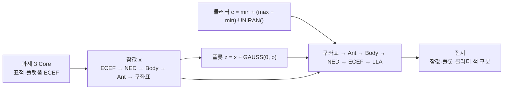

# 플롯·클러터 모의 학습·해결 가이드 (과제 4)

- 작성일: 2026-10-03
- 대상: `ref/과제 4 내용.txt`(원문), `ref/플롯_클러터_모의_구현_사양서.md`(사양서), `Part4_Plot_Clutter_Sim/참고 소스 코드/`(참고 코드)
- 목적: 과제 4를 풀기 위해 무엇을 어떤 순서로 익히고, 어떤 순서로 구현·검증·발표 준비를 할지 정리
- 상태: 구현 전. 7장의 결정 사항이 정해지면 6장의 기준 수치가 하나로 확정된다.

근거 표기

| 태그 | 의미 |
| --- | --- |
| [실행] | 참고 코드를 고치지 않고 복사해 MSVC로 컴파일·실행했거나, 그 출력과 비트 단위로 같은 이식본으로 계산한 값. 별도 계산으로 한 번 더 확인했다. |
| [문헌] | 교재·강의 자료에서 확인한 내용 (10장에 출처) |
| [판단] | 근거는 있지만 해석이 들어간 것. 결정이 필요하면 7장에 실었다. |

---

## 1. 한눈에 보기

과제는 세 가지 구현과 한 가지 전시, 그리고 발표에서 답할 개념 질문으로 이루어진다.

1. 난수 함수 검증: UNIRAN, GAUSS 각 10,000개의 분포 확인
2. 플롯 모의: 과제 3 대공 표적의 참값을 안테나 좌표 (거리, 방위각, 고각)로 바꾸고 성분별 가우시안 잡음을 더한다
3. 클러터 모의: 스캔마다 5개를 FOV 안에서 균등하게 뽑는다
4. 전시: 참값·플롯·클러터를 LLA에서 색을 달리해 그린다
5. 개념 설명: 플롯이란, 플롯 생성 과정 두 가지, 클러터란, 클러터를 단순하게 모의하는 이유



익혀야 할 것은 네 갈래다. 확률과 난수(검증 방법 포함), 레이다 측정 정확도, 좌표 사슬, 그리고 발표용 개념(신호처리 사슬, 클러터)이다. 순서는 4장에 있다.

---

## 2. 요구사항 지도

원문은 강의 목차(1~5장)와 실습 지시(6장)가 이어진 형태다. 줄 번호는 `ref/과제 4 내용.txt` 기준이다.

| 구분 | 줄 | 요구 | 내놓을 것 |
| --- | --- | --- | --- |
| 개념 | 2 | 플롯이란? | 정의와 그림 |
| 개념 | 3~9 | 플롯 생성 과정 두 가지 | 실제 사슬의 단계별 입력·출력, 모의에서 생략하는 것과 그 이유 |
| 개념 | 14~15 | 레이다 파라미터로 표적 SNR 계산 | 레이다 방정식 설명. 실습은 SNR을 고정값으로 둔다 |
| 개념 | 28~31 | 클러터란? 왜 단순하게 모의하나 | 정의와 종류, 이 모의로 검증하려는 것 |
| 구현 | 16~25, 54~56 | 표준편차 3개 → 성분별 가우시안 → z = x + v | 계산 코드와 값 |
| 구현 | 34~36, 58~63 | 클러터 개수·FOV 설정, 균등 난수로 추출 | 개수와 범위가 설정값으로 분리된 코드 |
| 구현 | 53 | 이전 차수의 대공 표적·플랫폼 위치 사용 | 과제 3 결과에서 참값을 얻는 사슬 |
| 검증 | 49 | UNIRAN 10,000개, 확률밀도가 1에 수렴 | 정규화 히스토그램과 통계 |
| 검증 | 50 | GAUSS(0, 1) 10,000개, 표준정규분포 | 히스토그램에 표준정규 곡선을 겹친 그림, 평균과 표준편차 |
| 조건 | 66 | 60초, 0.1초 간격 | 스캔 루프 |
| 전시 | 40, 67 | 참값·플롯·클러터를 LLA에서 색 구분 | 위경도 그림과 범례 |

- 40줄의 "5개 표적"은 강의 자료에 실린 결과 화면의 설명이고, 실습이 지목한 표적은 53줄의 대공 표적 1개다. [판단]
- 과제 3 원문의 "구조체 정의 설명", "코드를 통해 설명", "결과 설명"은 과제 4 원문에 다시 적혀 있지 않지만 같은 형식을 기대한다고 보는 편이 안전하다. [판단]

---

## 3. 시작 전에 알아둘 사실

원문, 사양서, 참고 코드가 서로 어긋나는 곳이다. 구현 전에 한 번 읽어 두면 시행착오가 줄어든다. 모두 [실행]으로 확인했다.

| 항목 | 원문·사양서 | 실제 | 따를 쪽 |
| --- | --- | --- | --- |
| 표준편차 식 | 원문 `square(2*SNR)` | 제곱근이다. Curry 교재 식 (8.6), (8.8)과 같은 꼴이고 교재 예제 수치가 제곱근으로 계산해야 맞는다. 제곱으로 구현하면 p_rng = 0.019 m로 잡음이 사라진다. | 제곱근 |
| GAUSS 호출 | 사양서 `p * GAUSS()` | 시그니처는 `double GAUSS(double m, double dev)`. 둘째 인자는 분산이 아니라 표준편차다. `GAUSS(0.0, p)`로 부른다. | 참고 코드 |
| 가우시안 방식 | 사양서는 Box–Muller 주의만 언급 | 균등 난수 12개 합에서 6을 뺀 근사다. log(0) 문제는 없고 대신 꼬리가 ±6에서 잘린다. | 참고 코드 |
| UNIRAN 구간 | 원문 "폐구간(0~1)" | 개구간 (0, 1)이다. 최소 4.66e-10, 최대 1 − 4.66e-10. | 참고 코드 |
| 빌드 | — | `NoiseGeneration.h`가 저장소에 없는 `CommonDefine.h`를 include해서 그대로는 컴파일되지 않는다(C1083). 빈 `CommonDefine.h`를 include 경로에 두면 원본을 고치지 않고 빌드된다. /W4 경고 2건(C4244)은 값 손실이 없는 종류다. | 7장 결정 |
| 방위각 부호 | 사양서 8장 "북 기준 시계방향이 +" | 조준축에서 왼쪽(반시계)이 +다. 플랫폼 자세 0이면 서쪽이 +. 과제 2 참고 자료(CIWS-II 2.1.10)와 과제 2 구현도 같은 규약이다. | 참고 코드 |
| 변환 순서 | 사양서 "구좌표 → ENU → ECEF" | 참고 코드에 ENU → ECEF는 없다. Ant → Body → NED → ECEF → LLA 순서다. | 참고 코드 |
| 스캔 수 | 사양서 600회 (t = 0.0~59.9) | 과제 3 Core는 601개 표본(t = 0.0~60.0)을 만든다. | 7장 결정 |
| 안테나 틸트 | 헤더에 `AntTiltAngle 22.0` | 어느 함수도 쓰지 않는다. 적용하면 대공 표적이 FOV 밖으로 나간다. | 0으로 둔다 [판단] |
| 인자 순서 | — | `f_Trans_Lla_To_Ecef(Lon, Lat, Alt)`는 경도가 먼저, `f_Trans_Ned_To_Ecef(.., Pf_Lat, Pf_Lon)`은 위도가 먼저, `f_Trans_Body_To_Ned(.., Roll, Yaw, Pitch)`는 구조체 멤버 순서와 다르다. 각도는 전부 rad. 틀려도 오류 없이 다른 값이 나온다. | — |
| Define.h | — | Part4 참고본에는 `#define BOOL bool`이 남아 있어 MFC와 충돌한다. 과제 3 Core의 수정본(`TargetSimCore/include/Define.h`)을 쓴다. | 과제 3 수정본 |
| 컴파일 옵션 | — | `matrixCalcLib.c`는 `/utf-8` 없이 컴파일하면 한글 주석이 다음 줄을 삼킨다. | `/utf-8` 유지 |
| 과제 3 빌드 산출물 | — | `Part3_TargetSim/src/TargetSim/build/`의 DLL·exe는 옛 판이다. 수치를 인용하려면 다시 빌드한다. | 다시 빌드 |

사양서 4.3절의 기대값 6개는 다시 계산해도 맞다.

---

## 4. 학습 로드맵

필수와 심화를 나눴다. 0~1단계가 끝나면 구현을 시작할 수 있고, 2단계는 발표 자료를 만들기 전까지, 3단계는 질문 대비로 필요한 만큼만 본다.

### 0단계 — 과제 2·3 복습

- 좌표 사슬 LLA – ECEF – NED – Body – Ant – 구좌표. 각 좌표계의 원점과 축 방향
- 참고 코드 함수의 인자 순서와 rad 단위 (3장 표)
- 과제 3 Core 사용법: `f_Tgt_InitSim` 한 번, `f_Tgt_StepSim` 반복. 스캔마다 `ST_SimSample`의 `st_Platform`, `st_Target[k]`에서 `st_PosEcef`[m], `st_Lla`(rad, m), `st_Att`(rad)를 읽는다

확인 질문
- 플랫폼 자세 0에서 정동 1 km 표적의 방위각은 몇 도인가? (−90°)
- 과제 3 Core나 UI에 플랫폼 기준 거리·방위각·고각을 계산하는 코드가 있는가? (없다. `f_Trans_Ned_To_Body`, `f_Trans_Body_To_Ant`, `f_Trans_Ant_XYZ_To_Sph`는 정의만 있고 호출이 없다. 이번에 새로 엮는다.)

### 1단계 — 구현에 꼭 필요한 이론

| 번호 | 익힐 것 | 요약 위치 |
| --- | --- | --- |
| 1 | U(0, 1), N(0, 1)의 PDF·평균·분산. 선형 변환 min + (max − min)·u, m + σ·z | 5.1 |
| 2 | `NoiseGeneration.c` 한 줄씩 읽기: Lehmer 점화식, 12개 합, 전역 SEED | 5.1 |
| 3 | 히스토그램을 PDF로 정규화하는 법과 bin 값의 통계 요동 | 5.2 |
| 4 | 측정 모델 z = x + v와 표준편차 식 3개. SNR의 선형값과 dB. 분해능과 정확도의 차이 | 5.3 |
| 5 | 안테나 좌표계의 축과 방위각 부호. 참값을 얻는 사슬과 LLA로 되돌리는 사슬 | 5.4 |
| 6 | 각도 오차가 거리에 비례해 위치 오차가 되는 관계 | 5.5 |
| 7 | 구좌표에서 균등하게 뽑은 점이 지도에서 가까운 쪽에 몰리는 이유 | 5.6 |

확인 질문
- `GAUSS(0, p)`와 `GAUSS(0, p*p)` 중 어느 것이 v ~ N(0, p²)인가? (앞쪽)
- 10,000개를 100칸으로 나누면 칸 값이 0.82~1.22로 흔들린다. 생성기 결함인가? (아니다. 칸당 100개의 통계 요동이고 이론 표준편차가 0.10이다.)
- 거리 오차는 4.7 m인데 화면의 플롯 산포는 왜 111 m인가? (횡거리 오차 = 거리 × 각도 오차. 13.3 km × 8.34 mrad)
- 방위각 +30° 클러터는 지도에서 동쪽인가 서쪽인가? (서쪽)
- p_azi를 도 단위 그대로 라디안 각에 더하면 어떻게 되나? (57배 틀린다)

### 2단계 — 발표의 개념 질문

- 히트, 플롯, 드웰, 트랙의 정의와 관계 (5.7)
- 실제 처리 사슬 7단계가 각각 무엇을 받아 무엇을 내놓는지 (5.7)
- 모노펄스의 합·차 채널과 기울기 상수 K_M (5.3)
- CFAR와 오경보, 클러터의 종류, 해면 클러터 (5.6, 5.7)
- 레이다 방정식에서 빔폭과 대역폭이 들어가는 자리 (5.8)
- 플롯 수준 모의가 생략하는 것 (5.7)

### 3단계 — 질문 대비 (선택)

- 정확도 식의 유래(크라메르–라오 하한), √(2·SNR)의 2
- 12개 합 가우시안의 초과첨도 −0.1과 ±6 절단
- 카이제곱 적합도 검정, 콜모고로프–스미르노프 검정
- 선형 합동 생성기의 약점, Box–Muller 변환
- 구좌표 측정을 직교좌표로 바꿀 때의 편향
- 다음 차수(추적)에서 쓰일 측정 잡음 공분산 R과 클러터 밀도 λ

---

## 5. 핵심 이론 요약

### 5.1 난수 생성

**UNIRAN** [실행]
- x(n+1) = 16807 · x(n) mod (2³¹ − 1), 출력은 x / (2³¹ − 1). Park–Miller "minimal standard" 생성기다.
- 주기 2,147,483,646. 과제 한 번 실행의 소비량(30,600개)은 주기의 0.0014%다.
- 출력은 (0, 1) 개구간이다. 상태가 1 ~ M − 1만 돌기 때문에 0과 1은 나오지 않는다.
- 시드 0, ±2147483647은 금지다. 상태가 0에 고정되어 UNIRAN은 계속 0, GAUSS(0, 1)은 계속 −6을 낸다. 코드는 시드를 검사하지 않는다.
- 음수 시드는 같은 크기의 양수 시드와 같은 수열을 낸다.
- 곱 a·x가 46비트라 `long long`이 필요하다. `changeSEED`의 인자는 `long`(Windows에서 32비트)이다.

**GAUSS(m, dev)** [실행]
- UNIRAN 12개 합에서 6을 빼고 dev를 곱해 m을 더한다. 중심극한정리를 이용한 근사다.
- 평균 0, 분산 12 × 1/12 = 1로 정확하다. 범위는 ±6, 초과첨도는 −0.1이다.
- 3σ 밖 확률이 정규분포의 0.746배, 4σ 밖은 0.269배로 꼬리가 얇다.
- 10,000개로는 정규분포와 구분되지 않는다. 100만 개쯤 되면 검정으로 구분된다.
- 한 번 부를 때 UNIRAN을 12번 쓴다.

**구현할 때 주의**
- 한 문장에 난수 호출은 하나만 둔다. MSVC x64는 함수 인자를 오른쪽부터 평가해서 `f(UNIRAN(), UNIRAN(), UNIRAN())`이면 순서가 뒤집힌다. [실행]
- SEED는 전역 하나라 플롯 잡음과 클러터가 같은 수열을 나눠 쓴다. 호출 순서를 고정하고 실행 시작에 `changeSEED`를 부른다. 난수 검증을 같은 실행에서 먼저 하면 그 뒤 모의 결과가 달라지므로 모의 전에 시드를 다시 맞춘다.
- 헤더에 `extern "C"`가 없다. C++(UI)에서 직접 include하면 링크가 안 된다(LNK2019). Core 안에서만 부르는 편이 간단하다.
- 부동소수 모델은 기본값(`/fp:precise`)을 유지한다. 이 조건에서 Debug와 Release 출력이 비트 단위로 같다. `/fp:fast`면 달라진다. [실행]

### 5.2 분포 검증

- PDF 추정: f(bin) = count / (N · Δ). N은 표본 수, Δ는 칸 폭.
- 균등분포를 K칸으로 나누면 칸 값의 표준편차는 √((K − 1) / N)이다. N = 10,000일 때

| 칸 수 K | 10 | 20 | 50 | 100 |
| --- | --- | --- | --- | --- |
| 이론 표준편차 | 0.030 | 0.044 | 0.070 | 0.100 |
| 기준 실행의 칸 값 범위 | 0.970~1.049 | 0.940~1.070 | 0.840~1.160 | 0.820~1.220 |

- 표본 평균의 표준오차는 σ/√N: 균등 0.0029, 정규 0.010. 표본 표준편차의 표준오차는 약 σ/√(2N): 정규 0.0071.
- 권장 기준 [판단]
  - UNIRAN: 20칸, 각 칸이 1 ± 0.131(3σ) 안. 평균 0.5 ± 0.0087, 분산 0.0833 ± 0.0022.
  - GAUSS: 칸 폭 0.2, 구간 [−4, 4]. 칸별 허용 오차 ±3·√(p(1 − p)/N)/Δ(정점에서 ±0.041). 평균 0 ± 0.03, 표준편차 1 ± 0.021.
  - "수렴"을 보이려면 N을 100, 1,000, 10,000, 100,000으로 늘린 표 하나를 더한다. 오차가 1/√N으로 준다.
- 기준 실행(시드 12345) [실행]
  - UNIRAN 10,000개: 평균 0.502620, 분산 0.083636, 최소 1.44e-5, 최대 0.999966. 카이제곱 6.62(10칸, 자유도 9, p = 0.68).
  - 시드를 다시 맞춘 GAUSS(0, 1) 10,000개: 평균 0.003643, 표준편차 0.998434, 최소 −3.3258, 최대 3.7577, |x| > 3인 표본 23개(정규 기대 27.0개).
  - 분산과 표준편차는 n − 1로 나눈 값이다. 규약을 하나로 정해 자료 전체에 쓴다.

### 5.3 측정 정확도

```
p_rng = c / (2 · B · √(2 · SNR))
p_azi = θ_azi / (K_M,azi · √(2 · SNR))
p_ele = θ_ele / (K_M,ele · √(2 · SNR))
```

- 꼴은 "분해능 ÷ √(2·SNR)"이다. 거리 분해능은 c/2B = 29.98 m, 각도 분해능은 빔폭(5.14°, 5.31°)이다. 분해능은 두 표적을 따로 볼 수 있는 간격이고, 정확도는 한 표적의 측정값이 참값 주위에 흩어지는 정도다.
- K_M은 모노펄스 기울기 상수(무차원)다. 합 채널과 차 채널의 비가 각도에 비례하는 정도를 빔폭으로 정규화한 값으로, 전형값은 1.6이고 문헌 범위는 1.2~2.0이다. 1.7은 그 안에 든다. [문헌]
- SNR은 선형 전력비이고 드웰 수준(펄스압축·도플러 처리 뒤)의 값이다. dB로 주어지면 10^(dB/10)으로 바꾼다. [문헌]
- 식은 열잡음만 있을 때의 높은 SNR 근사다. √(2·SNR)의 2는 정합필터 출력의 에너지비 2E/N0에서 온다. [문헌]
- 원문 값으로 계산한 결과 [실행]

| 항목 | SNR = 20 (선형, 13.0 dB) | SNR = 20 dB (선형 100) |
| --- | --- | --- |
| p_rng | 4.740135 m | 2.119853 m |
| p_azi | 0.478062° (8.344 mrad) | 0.213796° (3.731 mrad) |
| p_ele | 0.493873° (8.620 mrad) | 0.220867° (3.855 mrad) |

- "SNR 20"의 단위는 원문만으로 정해지지 않는다. [판단]
  - 선형 쪽 근거: 원문 식에 dB 변환 단계가 없고, 다른 값에는 단위를 붙였는데 SNR에는 없다. 13 dB는 전형적인 탐지 문턱이다.
  - dB 쪽 근거: 레이다에서 SNR은 보통 dB로 말한다. 매 스캔 플롯이 반드시 생긴다는 과제의 전제는 탐지확률이 1에 가까운 20 dB와 더 잘 맞는다.
- 식의 한계: 과제 식은 SNR에 의존하는 항만 남긴 것이다. 실제로는 고정 오차와 바이어스가 더해져 SNR이 높아도 오차에 바닥이 있다. [문헌]

### 5.4 좌표 사슬

참고 코드의 정의 [실행]
- 안테나 직교좌표: x = r·cos(el)·sin(az), y = r·sin(el), z = r·cos(el)·cos(az). x는 왼쪽, y는 위, z는 조준축이다.
- 안테나 → 동체: Body = (Ant.z, −Ant.x, −Ant.y). 동체는 전방–우현–아래다.
- 동체 → NED: NED = Rz(Yaw)·Ry(Pitch)·Rx(Roll)·Body.
- 플랫폼 자세가 0이면 조준축은 북쪽, 방위각 +는 서쪽이다. 일반식은 az = Yaw − (표적 방위, 북 기준 시계방향).

```c
// 참값: 표적 ECEF -> (r, az, el)
ned  = f_Trans_Ecef_To_Ned(tgE.x, tgE.y, tgE.z, pfE.x, pfE.y, pfE.z, pfLat, pfLon);
body = f_Trans_Ned_To_Body(ned.x, ned.y, ned.z, pfRoll, pfYaw, pfPitch);
ant  = f_Trans_Body_To_Ant(body.x, body.y, body.z);
sph  = f_Trans_Ant_XYZ_To_Sph(ant.x, ant.y, ant.z);      // r [m], az, el [rad]

// 전시: (r, az, el) -> LLA
ant  = f_Trans_Ant_Sph_To_XYZ(r, az, el);
body = f_Trans_Ant_To_Body(ant.x, ant.y, ant.z);
ned  = f_Trans_Body_To_Ned(body.x, body.y, body.z, pfRoll, pfYaw, pfPitch);
ecef = f_Trans_Ned_To_Ecef(ned.x, ned.y, ned.z, pfE.x, pfE.y, pfE.z, pfLat, pfLon);
lla  = f_Trans_Ecef_To_Lla(ecef.x, ecef.y, ecef.z);      // Lat, Lon [rad], Alt [m]
```

대공 표적의 참값 (플랫폼 자세 0, 과제 3 Core 기본 계산) [실행]

| t [s] | 거리 [m] | 방위각 [°] | 고각 [°] |
| --- | --- | --- | --- |
| 0.0 | 13310.236 | 0 | 1.23150 |
| 30.0 | 7313.155 | 0 | 2.31810 |
| 59.9 | 1360.625 | 0 | 12.73165 |
| 60.0 | 1341.125 | 0 | 12.92013 |

- 60초 내내 클러터 FOV(200~15,000 m, ±60°, 0~30°) 안에 있다. 시나리오가 "자세 0, 조준축 북쪽"을 전제로 짜였다고 볼 근거다. [판단]
- 지구 곡률 때문에 고각이 평면 지구 값보다 작다(13.3 km에서 0.060°, 높이로 13.9 m). 역변환을 "고도 = r·sin(el)"로 줄이면 300 m가 286 m로 나온다. 사슬을 그대로 쓰면 300.000 m다.
- 과제 3의 대함 표적은 고각이 −0.064°(수평선 아래)이고 방위각이 −11.5°다. 고각 하한 0°를 적용하면 FOV 밖이다.
- 사슬의 왕복 오차는 이 과제 범위에서 0.03 mm 이하다. 참고 코드의 ECEF → LLA에는 결함(경도 사분면, 극점)이 있지만 위도 32°, 경도 126° 부근에서는 영향이 없다.
- p_azi, p_ele, 클러터 FOV는 도 단위로 주어진다. 도 → 라디안 변환은 설정을 읽는 한 곳에서만 한다.

### 5.5 오차의 기하

- 횡거리 오차 = r·cos(el)·σ_az, 수직 오차 = r·σ_el, 거리 방향 오차 = σ_r. [실행]

| t [s] | 거리 방향 | 횡거리 | 수직 |
| --- | --- | --- | --- |
| 0.0 | 4.74 m | 111 m | 115 m |
| 30.0 | 4.74 m | 61 m | 63 m |
| 59.9 | 4.74 m | 11 m | 11.5 m |

(선형 20 기준. 20 dB면 모두 1/2.236배)

- 각도 오차가 위치 오차를 지배한다. 플롯은 표적이 다가올수록 좁아지는 깔때기 모양으로 흩어진다.
- 이 표적은 정북에 있어서 거리 잡음은 위도, 방위각 잡음은 경도, 고각 잡음은 고도로 거의 나뉘어 들어간다.
- 선형 20이면 초반에 플롯 고도가 음수로 나올 수 있다. 참고 GAUSS 기준으로 t = 0에서 스캔당 0.39%, 600 스캔 기대 0.23개, 한 번 실행에서 1개 이상 나올 확률이 약 21%다. 20 dB에서는 사실상 없다. 오류가 아니라 모델의 결과다. [실행]
- 화면 축척: 클러터 FOV 전체(동서 26 km)를 과제 3 UI의 기본 창에 담으면 플롯 산포 1σ가 1~2 px 정도라 참값 선과 겹친다. 표적 주변 보기나 고도–시각 그림이 있어야 플롯이 구분된다. [판단, 배치 상수로 어림]

### 5.6 클러터

- c = min + (max − min)·u, u는 `UNIRAN()`. 성분마다 따로 부르고 스캔마다 새로 뽑는다. 표적과 무관하다.
- 구좌표에서 균등하게 뽑으면 직교 공간의 밀도는 1/(r²·cos el)에 비례하고, 동–북 평면의 면밀도는 수평거리 ρ에 반비례한다. 3,000점(600 스캔 × 5개) 기준으로 ρ = 250 m 근처는 약 406개/km², 9 km 근처는 약 11개/km²다. 수평거리의 중앙값은 7,244 m다. 레이다 가까이가 촘촘한 것은 정상이다. [실행]
- 전시 범위(자세 0): 위도 32.0008~32.1353°, 경도 125.8624~126.1376°, 고도 0~7,513 m. 방위각 +60°는 서쪽(경도 125.862)에 찍힌다. [실행]
- 추적 문헌의 표준 오경보 모형은 "측정 공간에서 균등, 개수는 포아송"이다. CFAR가 분해능 셀마다 오경보확률을 같게 유지하고, 그 셀 격자가 거리·각도 공간에서 등간격이기 때문이다. 과제는 이것의 단순화판이다. [문헌]
- 과제 값의 클러터 밀도는 λ = 5 / (14,800 m × 120° × 30°) = 9.38e-8 /(m·deg²)다. 다음 차수의 자료 연관에서 쓰인다.
- 실제 해면 클러터는 해면 근처에 있다. 고각 0~30°에 균등하게 뿌리는 것은 물리 모형이 아니라 추적기 시험용 통계 모형이다. [판단]

### 5.7 실제 처리 사슬과 플롯 수준 모의

| 용어 | 뜻 |
| --- | --- |
| 드웰 | 빔이 한 방향에 머물며 신호를 모으는 단위 |
| 히트 | 신호처리 출력에서 문턱을 넘은 셀(거리–도플러–빔) 하나. 한 표적이 여러 히트를 낸다 |
| 플롯 | 같은 표적에서 나온 히트를 묶어 대표 위치로 줄인 측정 보고. 추적기의 입력 |
| 트랙 | 같은 표적의 플롯을 시간에 걸쳐 연관하고 필터로 평활한 상태 추정 |

| 단계 | 하는 일 | 필요한 이유 |
| --- | --- | --- |
| IQ 데이터 | 수신 신호를 기저대역 복소 표본으로 만든다 | 위상이 있어야 정합필터, 도플러, 모노펄스 계산이 된다 |
| 펄스압축 | 변조된 긴 펄스를 정합필터로 좁게 압축한다. 분해능 c/2B | 긴 펄스의 에너지와 넓은 대역의 분해능을 함께 얻는다 |
| 도플러 처리 | 한 드웰의 펄스 열을 속도 방향으로 걸러 낸다 | 정지·저속 클러터를 분리하고 적분으로 SNR을 올린다 |
| CFAR | 주변 셀로 간섭 수준을 추정해 문턱을 정한다 | 잡음 수준이 바뀌어도 오경보율을 일정하게 유지한다 |
| Hit 추출 | 문턱을 넘은 셀을 목록으로 뽑는다 | 후보만 남긴다 |
| Hit 클러스터링 | 인접 셀의 히트를 한 덩어리로 묶고 대표점을 정한다 | 한 표적이 여러 플롯이 되는 것을 막는다 |
| 모노펄스 | 합·차 채널의 비로 빔 중심 대비 각도를 구한다 | 빔폭보다 한 자릿수 정밀한 각도를 한 번에 얻는다 |

- 플롯 수준 모의가 가능한 이유: 추적기가 보는 것은 플롯뿐이고, 추적 필터는 처음부터 "측정 = 참값의 함수 + 가우시안 잡음"을 가정한다. 사슬 전체의 효과를 표준편차 세 개로 요약해 같은 통계의 입력을 만든다.
- 잡음을 가우시안으로 두는 이유: 수신기 열잡음의 I, Q 성분이 가우시안이고, SNR이 높으면 거리·각도 추정 오차가 그 잡음의 선형 함수로 근사된다. 거리, 방위 차 채널, 고각 차 채널의 잡음이 서로 독립이라 성분별로 따로 뽑는다.
- 생략되는 것: 미탐지(탐지확률 < 1), 인접 표적의 플롯 병합, 바이어스와 고정 오차, 글린트, 저고각 다중경로, 거리에 따른 SNR 변화.

### 5.8 레이다 방정식과 고정 SNR

```
SNR = Pt · G² · λ² · σ / ((4π)³ · R⁴ · k · T0 · B · F · L)
```

- 원문이 든 파라미터가 들어가는 자리: 빔폭은 안테나 이득 G ≈ 4π/(θ_az·θ_el)로 들어간다(5.14° × 5.31°면 약 1,511, 31.8 dBi). 대역폭은 잡음 전력 k·T0·B로 들어간다(5 MHz면 2.0e-14 W).
- 송신 전력, 파장, RCS, 잡음지수, 손실이 주어지지 않아 SNR을 계산할 수 없다. 그래서 실습은 고정값을 쓴다.
- SNR은 R⁻⁴에 비례한다. 표적이 13.3 km에서 1.34 km로 오면 실제로는 약 40 dB 오른다. 고정 SNR은 이 변화를 무시한 단순화다.

---

## 6. 해결 절차와 합격 수치

### 6.1 구조 [판단]

- 과제 3 솔루션을 `Part4_Plot_Clutter_Sim/src/`로 가져와 확장하는 방식이 Part 1~3의 관례(파트마다 `src` 아래 솔루션 하나, C Core + MFC UI)와 맞는다.
- 플롯·클러터 모듈은 Core 안에 둔다. Core DLL이 내보내는 함수는 `f_Tgt_*` 5개뿐이라 참고 코드의 `f_Trans_*`를 DLL 밖에서 부를 수 없기 때문이다.
- 새 파일은 Core의 플롯·클러터 모듈 한 쌍, `NoiseGeneration.c/.h`, `CommonDefine.h` 정도로 묶을 수 있다.
- UI에서 손댈 곳: `CSimResult`(플롯·클러터 보관), `CTrajectoryPlot::f_ComputeView`(보이는 범위), `f_DrawMap`(점 그리기와 범례), `UiCommon.h`(종류별 색), 결과 표와 CSV.
- UI에서 `Plot`은 이미 "그림"이라는 뜻으로 쓰인다(`CTrajectoryPlot`, `f_Plot_*`). 레이다 플롯 쪽 이름과 겹치지 않게 한다.

구조체 초안 (이름은 결정 사항)

| 구조체 | 담는 것 |
| --- | --- |
| 레이다 설정 | SNR(선형), 대역폭 [Hz], 빔폭 2개 [rad], K_M 2개 |
| 측정 표준편차 | 거리 [m], 방위각·고각 [rad] |
| 클러터 설정 | 스캔당 개수, 거리·방위각·고각의 최소·최대 |
| 플롯 1개 | 표적 번호, 참값 (r, az, el), 측정값 (r, az, el), LLA |
| 클러터 1개 | 측정값 (r, az, el), LLA |
| 스캔 결과 | 시각, 스캔 번호, 플롯 수와 배열, 클러터 수와 배열 |

코딩룰의 예시(`GenPlotinfo(ST_PlotInfo *st_PlotInfo, const ST_TargetInfo *st_Target)`)처럼 출력 포인터를 먼저, 입력은 `const` 포인터로 둔다. 광속은 `Define.h`의 `LIGHT_SPEED`를 쓴다. 참값과 표적 번호는 다음 차수에서 추적 결과를 평가할 때 쓰도록 플롯과 함께 보관한다.

### 6.2 단계와 합격 수치

기준 수치의 조건: 시드 12345, 선형 SNR 20, 대공 표적 1개, 플랫폼 자세 0, 과제 3 Core 기본 계산(`noMidPoint` 0, `usePlatform` 0), 스캔 k = 0~599. 스캔마다 GAUSS를 거리 → 방위각 → 고각 순으로 부르고, 이어서 클러터 5개를 차례로 UNIRAN 거리 → 방위각 → 고각 순으로 뽑는다. 조건이 하나라도 다르면 M4, M5의 숫자는 달라진다. [실행]

| 단계 | 할 일 | 합격 기준 |
| --- | --- | --- |
| M0 빌드 | 솔루션 구성, NoiseGeneration 추가, `/utf-8` | `changeSEED(1)` 뒤 UNIRAN 10,000회 → `valueSEED()` = 1043618065 |
| M1 난수 검증 | 10,000개 통계와 칸별 개수 | UNIRAN 첫 값 0.0966165285, 평균 0.502620, 분산 0.083636, 20칸 값 0.940~1.070. 시드를 다시 맞춘 GAUSS(0, 1) 평균 0.003643, 표준편차 0.998434 |
| M2 표준편차 | 식 3개 | 4.740135 m, 0.478062°, 0.493873° (20 dB면 2.119853 m, 0.213796°, 0.220867°) |
| M3 참값 사슬 | ECEF → (r, az, el) | 정동 1 km 표적의 방위각 −89.9972°. 정북 1 km·고도 500 m 표적의 고각 +26.5596°. 대공 표적 k = 0에서 (13310.236 m, 0°, 1.23150°), k = 600에서 (1341.125 m, 0°, 12.92013°) |
| M4 플롯 | z = x + GAUSS(0, p) | 첫 플롯 오차 (−2.115046 m, −0.368953°, +0.825561°). 600 스캔의 (z − x) 표본 표준편차 4.6849 m, 0.48698°, 0.49323° |
| M5 클러터 | 스캔당 5개 | 첫 클러터 (13862.184 m, +46.4939°, 10.6957°). 3,000개 평균 7461.6 m, −1.23°, 14.87°. 끝난 뒤 UNIRAN 30,600회, SEED = 741777918 |
| M6 LLA | (r, az, el) → LLA | (10 km, +30°, 0°) → 위도 32.0780884, 경도 125.9470412, 고도 7.860 m. 참값을 구좌표로 바꿨다 되돌린 오차 3.1e-5 m 이하 |
| M7 결과 파일 | CSV | Debug와 Release 출력이 같음 |
| M8 화면 | 3색, 범례, 보기 전환 | 방위각 +60° 클러터가 지도 왼쪽(서쪽)에 찍힘. 플롯이 참값과 구분되어 보임 |
| M9 발표 자료 | 9장 | — |

- M4의 표본 표준편차는 이론값의 0.988, 1.019, 0.999배다. 600개 표본으로 구한 표준편차는 1σ로 2.9% 흔들리므로 ±9% 안이면 정상이다.
- 601 스캔(k = 0~600)으로 가도 앞 600 스캔의 수치는 그대로이고 UNIRAN 소비만 30,651회가 된다.
- 스캔 루프는 정수로 세고 시각은 k × 0.1로 계산한다. `for (t = 0; t <= 60.0; t += 0.1)`은 누적 오차 때문에 601번이 아니라 600번 돈다.

---

## 7. 결정 사항

정해져야 결과가 하나로 확정되는 항목이다. 사양서는 미결을 2건으로 적었지만 실제로는 더 있다.

| 번호 | 항목 | 선택지 | 권장 [판단] | 영향 |
| --- | --- | --- | --- | --- |
| 1 | SNR 20의 단위 | 선형 20 / 20 dB | 기본은 선형 20, 단위를 바꿀 수 있게 두고 두 경우를 함께 제시. 강사 확인 | 표준편차 2.236배 |
| 2 | 스캔 격자 | 600회(k = 0~599) / 601개(k = 0~600) | 601개. 과제 3 결과와 행이 1:1로 맞는다 | 플롯 600/601개, 클러터 3,000/3,005개 |
| 3 | 스캔당 클러터 수 | 정확히 5개 / 0~5개 무작위 / 평균 5 포아송 | 정확히 5개. 개수는 설정값으로 둔다 | 총 3,000개 대 평균 1,500개 |
| 4 | 플랫폼 자세와 틸트 | 자세 0·틸트 없음 / 틸트 22° 적용 | 자세 0, 틸트 없음 | 틸트를 넣으면 표적이 FOV 밖 |
| 5 | 방위각 부호 | 참고 코드(왼쪽 +) / 사양서(시계방향 +) | 참고 코드. 화면과 CSV에 규약을 적는다 | 점마다 경도가 126°선을 축으로 뒤집힌다 |
| 6 | 난수 함수 | 참고 코드 그대로 + 빈 `CommonDefine.h` / 헤더 수정 / 직접 구현 | 참고 코드 그대로. 과제 3에서 참고 코드를 원본대로 쓴 방침과 같다 | 경고 2건 처리 방법도 함께 정한다 |
| 7 | 시드와 호출 순서 | 시드 값, 실행마다 재설정 여부, 수열 공유 여부 | 12345, 모의와 검증 각각의 시작에서 재설정, 수열 공유, 6.2의 호출 순서로 고정 | 재현성 |
| 8 | 플롯 대상 | 대공 표적 1개 / 시나리오의 모든 표적 / 5개 표적 프리셋 | 기본은 대공 표적 1개, 5개 표적은 선택 | 난수 소비량과 수열 배분 |
| 9 | 탐지 단순화 | FOV 판정, 미탐지, 음수 고도 자르기 | 넣지 않고 가정으로 밝힌다. 자르면 분포가 왜곡된다 | — |
| 10 | 솔루션 구조 | Part4로 복사해 확장 / 콘솔과 별도 그림 / Part3 직접 확장 | Part4로 복사해 확장 | 파일 수와 작업량 |
| 11 | 설정 입력 | 전부 UI 칸 / 최소 칸만 / 전부 상수 | SNR 값과 단위, 클러터 수, 시드만 UI에 둔다 | 원문의 "개수 입력", "범위 설정" 대응 |
| 12 | 전시 구성 | 누적 / 스캔별 재생, 확대 방식 | 위경도 누적 + 전체·표적 주변 보기 전환 + 고도–시각에 플롯 고도 겹치기 | 플롯이 구분되어 보이는지 |
| 13 | 결과 파일 | 가로형 CSV에 열 추가 / 세로형 파일 따로 | 세로형(scan, time, kind, id, range, az, el, lat, lon, alt) | 다음 차수 입력으로 쓰기 쉽다 |
| 14 | 폴더와 줄바꿈 | `참고 소스 코드`를 `ref` 아래로 옮길지, 새 C/H 파일의 줄바꿈 | 과제 3과 같은 배치. 줄바꿈은 파일을 만들기 전에 정한다 | — |
| 15 | 사양서 정정 | 고친다 / 그대로 둔다 | 고친다(GAUSS 호출, 8장 좌표 가정, 스캔 수, 미결 건수) | 틀린 식을 옮길 위험 |

강사에게 확인하면 좋은 것: SNR 20의 단위, `CommonDefine.h` 원본이 있는지, `AntTiltAngle` 22°를 적용할 의도가 있는지, 5개 표적 전시가 필수인지, 스캔당 클러터가 정확히 5개인지.

---

## 8. 검증 체크리스트

- [ ] 난수: 5.2의 기준과 6.2의 M0, M1 수치
- [ ] 표준편차: M2 수치. 제곱이 아니라 제곱근으로 구현했는지
- [ ] 단위: 각도 표준편차와 FOV를 rad로 바꾼 뒤 더했는지
- [ ] 축 밖 시험점: 정동 1 km 표적의 방위각이 −90° 근처인지. 대공 표적은 방위각이 0이라 부호가 뒤집혀도 그림으로는 드러나지 않는다
- [ ] 왕복: 참값을 구좌표로 바꿨다 LLA로 되돌린 값이 과제 3 결과와 같은지
- [ ] 플롯 잔차: (z − x)/p를 세 성분 모두 모아 히스토그램을 그리면 표준정규 곡선과 겹치는지. 기준 실행에서 1,800개의 평균 0.025, 표준편차 1.0015
- [ ] 성분 독립: 세 잔차의 표본 상관이 0 ± 0.12 안인지. 한 난수를 두 성분에 쓰면 여기서 걸린다
- [ ] 클러터: 스캔마다 개수가 맞는지, 최소·최대가 FOV 안인지, 성분별 평균이 범위 중앙값에서 3 표준오차(78 m, 0.63°, 0.16°의 3배) 안인지
- [ ] 재현: 같은 시드로 두 번 실행한 결과가 같은지, Debug와 Release 출력이 같은지
- [ ] 화면: 방위각 +60° 클러터가 서쪽에 찍히는지, 세 종류의 색이 구분되는지

---

## 9. 발표 준비

과제 3 때 정한 방식을 그대로 따른다고 보고 적었다. [판단]

- 구성: 앞쪽에 요구사항 대응표(원문 항목 – 구조체·함수 – 슬라이드)를 두고, 장 이름은 단어로 짓는다. 예: 플롯과 클러터 / 난수 확인 / 플롯 모의 / 클러터 모의 / 결과
- 개념 장: 플롯이란, 플롯 생성 과정 두 가지, 클러터란과 단순 모의의 이유
- 코드 장: 핵심 함수를 하나씩, 줄마다 주석을 달아 순서대로 설명한다. 대상은 UNIRAN, GAUSS, 표준편차 계산, 참값 계산, 플롯 생성, 클러터 생성, 구좌표 → LLA, 스캔 루프, 구조체
- 결과 장: UNIRAN 히스토그램, GAUSS 히스토그램과 표준정규 곡선, 표준편차의 이론값과 표본값 표, LLA 전시(전체와 확대), 고도–시각
- 통계 검정, 생성기의 약점, 12개 합의 꼬리 같은 심화는 본문 한 줄이나 질문 대비로만 둔다

가정 (발표에서 밝힐 것)

| 가정 | 내용 |
| --- | --- |
| 탐지 | 매 스캔 표적마다 플롯 1개(탐지확률 1). 표적에는 FOV 판정을 하지 않는다 |
| SNR | 거리와 무관하게 고정 |
| 잡음 | 거리·방위각·고각 성분이 서로 독립인 가우시안. 바이어스 없음 |
| 클러터 | 스캔마다 새로 뽑고 표적과 무관. 구좌표에서 균등 |
| 플랫폼 | 자세 0, 안테나 틸트와 설치 오프셋 없음 |
| 시각 | 한 스캔의 모든 플롯은 같은 시각. 도플러 측정 없음 |

예상 질문

| 질문 | 답의 요지 |
| --- | --- |
| `square`를 제곱근으로 읽은 근거 | 교재 식과 꼴이 같고 예제 수치가 제곱근으로 맞는다. 제곱이면 표준편차가 0.019 m다 |
| SNR 20의 단위 | 두 해석의 표준편차를 함께 제시한다 (5.3 표) |
| 왜 가우시안인가 | 열잡음이 가우시안이고 높은 SNR에서 추정 오차가 그 선형 함수다 |
| 클러터가 레이다 근처에 몰려 보이는 이유 | 구좌표에서 균등하게 뽑아서 직교 공간 밀도가 1/(r²·cos el)에 비례한다 |
| 고도가 음수인 플롯이 나오는 이유 | 초반 참 고각 1.23°가 고각 표준편차의 2.5배밖에 안 된다 |
| 12개 합 GAUSS의 한계 | 분산은 정확히 1, 범위 ±6, 3σ 밖 확률이 정규의 75% |
| UNIRAN이 0과 1을 내지 않는 이유 | 상태가 1 ~ M − 1만 돈다 |
| 실제라면 달라지는 것 | 거리에 따른 SNR, 미탐지, 저고각 다중경로, 고정 오차 |
| 다음 차수와의 연결 | 표준편차는 측정 잡음 공분산 R이 되고, 스캔당 5개는 클러터 밀도 λ가 된다 |

---

## 10. 학습 자료

조사 중에 열어 본 자료다. 교재의 장·절 번호는 판본에 따라 다를 수 있다.

| 주제 | 자료 |
| --- | --- |
| 측정 정확도 식 | Curry, *Radar System Performance Modeling* 2판 8장 (출판사 공개 발췌본: https://beckassets.blob.core.windows.net/product/readingsample/170508/9781580538169_excerpt_001.pdf) · Skolnik, *Introduction to Radar Systems* 3판 6장 |
| 처리 사슬, 모노펄스 | MIT Lincoln Laboratory "Introduction to Radar Systems" 강의 (https://ocw.mit.edu/courses/res-ll-001-introduction-to-radar-systems-spring-2007/), 강의 9 슬라이드 (https://www.ll.mit.edu/sites/default/files/outreach/doc/2018-07/lecture%209.pdf) · Sandia SAND2024-06153 (https://www.osti.gov/servlets/purl/2429954) · Richards, *Fundamentals of Radar Signal Processing* |
| 플롯 추출 | Cambridge Pixel, Plot Extraction (https://cambridgepixel.com/resources/radar-terminology/plot-extraction/) · Wikipedia "Radar tracker" |
| 강의 내부 자료 | `Part2_CoordFrames/ref/참고 자료/CIWS-II 데이터처리를 위한 좌표계 및 좌표변환` 2.1.9~2.1.10 (안테나 좌표계, 방위각 부호) · 같은 폴더 `다중모드 능동위상배열 레이더 시험시제` (HIT, Dwell, Plot) |
| 클러터, 추적 | Skolnik 7장 · Stone Soup 튜토리얼 (https://stonesoup.readthedocs.io/en/latest/auto_tutorials/index.html) · Bar-Shalom, Daum, Huang, "The Probabilistic Data Association Filter", IEEE Control Systems Magazine, 2009 |
| 난수 생성 | Wikipedia "Lehmer random number generator" · Press 외, *Numerical Recipes* 7.1절 · Thomas 외, "Gaussian Random Number Generators", ACM Computing Surveys 39(4), 2007 (https://www.doc.ic.ac.uk/~wl/papers/07/csur07dt.pdf) |
| 분포 검정 | NIST/SEMATECH e-Handbook, Chi-Square Goodness-of-Fit Test (https://www.itl.nist.gov/div898/handbook/eda/section3/eda35f.htm), Kolmogorov–Smirnov Test (https://www.itl.nist.gov/div898/handbook/eda/section3/eda35g.htm) |
| 국내 사례 | 서정직, "전투기 레이다 측정 특성을 고려한 추적 정확도 분석", 한국전자파학회논문지 29(8), 2018 (https://www.jkiees.org/archive/view_article?pid=jkiees-29-8-640) |
